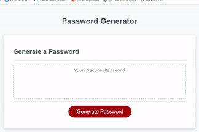

# Password Generator with JavaScript

**[Run Application!](https://jmantis0.github.io/password-generator/)**

This password generator allows you to create any number of random passwords and offers you the option to include or exclude certain character types.

## -Features-

### Length Selection
Choose to generate a random password anywhere from 8 to 128 characters long.

### Character Types
Choose whether to include or exclude four different character types:

* Uppercase Alphabetic
* Lowercase Alphabetic
* Numeric
* Special

### Guaranteed Character Inclusion
Generator is specially programmed to generate passwords that include at least one character of each type you select to include.